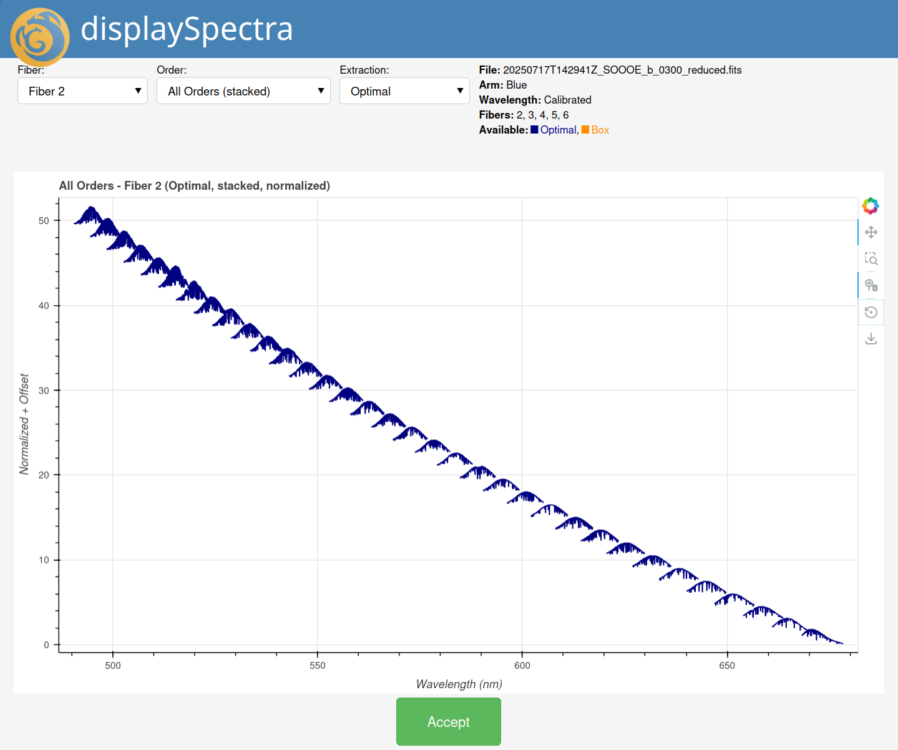
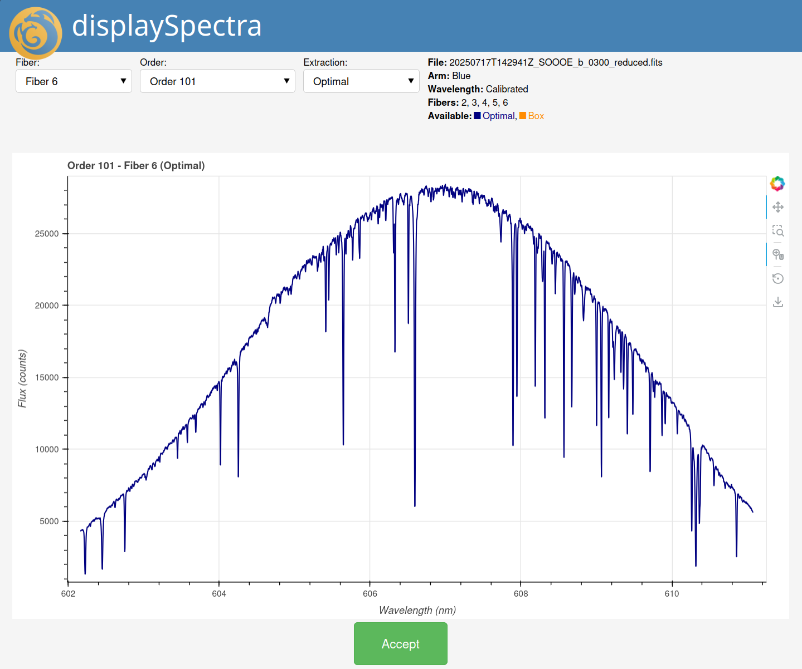

.. maroonx_display.rst

.. _maroonx_display:

****************************
Inspecting Extracted Spectra
****************************

The ``displaySpectra`` primitive opens an interactive view of extracted
spectra in the web browser. It starts a Bokeh server at
``http://localhost:5006`` (or the next free port), with dropdowns to
select the fiber, an individual order or all orders, and the extraction
type (optimal or box), plus zoom, pan and hover tools.

It works on any file with extracted spectra, for example the
``*_reduced.fits`` outputs of the science reduction step. With
``show_wavelength=True`` the spectra are plotted against wavelength when
the file carries a wavelength solution; otherwise pixel space is used.

From the Command Line
=====================

``displaySpectra`` is not part of a recipe; ``reduce`` runs it directly
when its name is passed to ``--recipe``:

.. code-block:: bash

    reduce --adpkg maroonx_instruments --drpkg maroonxdr \
        --recipe displaySpectra \
        -p fibers=2,3,4 -p show_wavelength=True \
        20250717T142941Z_SOOOE_b_0300_reduced.fits

The log will show ``No recipe can be found in maroonx recipe libs`` and
``Found 'displaySpectra' as a primitive``; these messages are the normal
path, not an error.

.. note:: List parameters on the command line are written as
   comma-separated values without brackets: ``-p fibers=2,3,4``, or
   ``-p fibers=6`` for the combined fiber. The bracket form
   ``-p fibers=[6]`` fails parameter validation.

   The viewer showing all orders of fiber 2, stacked and normalized.

   A single order of the combined fiber 6, in wavelength space.
