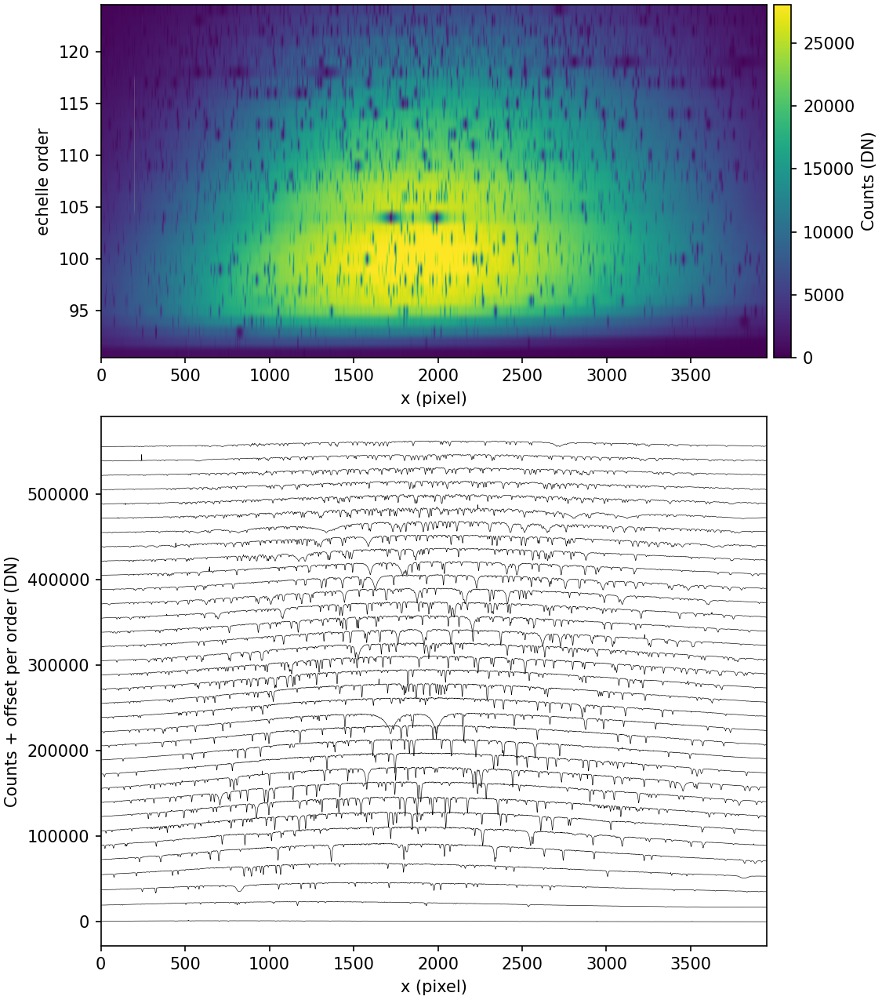

.. primitive_boxExtraction.rst

.. _primitive_boxExtraction:

*************
boxExtraction
*************

.. include:: generated_doc/maroonxdr.maroonx.primitives_maroonx_echelle.MAROONXEchelle.boxExtraction_docstring.rst

.. include:: generated_doc/maroonxdr.maroonx.primitives_maroonx_echelle.MAROONXEchelle.boxExtraction_param.rst

Algorithm
---------

.. todo::
    add description

   Box extraction of fiber 3 of a ``SOOOE`` science frame (blue arm),
   as stored in ``BOX_REDUCED_FIBER_3``. Top: the extracted 2D array,
   one row per echelle order. Bottom: the same spectra plotted per
   order with a vertical offset.

Issues and Limitations
----------------------

.. todo::
    add description
