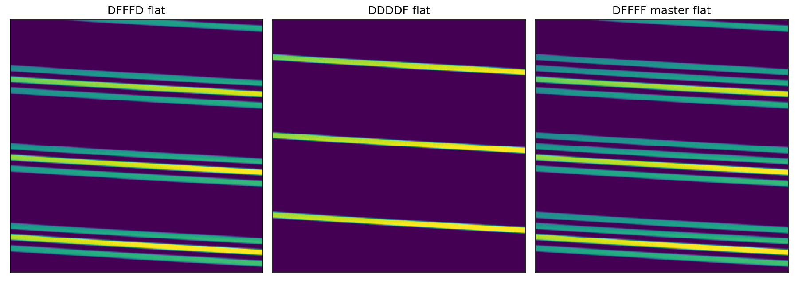

.. primitive_combineFlatStreams.rst

.. _primitive_combineFlatStreams:

******************
combineFlatStreams
******************

.. include:: generated_doc/maroonxdr.maroonx.primitives_maroonx_2D.MAROONX.combineFlatStreams_docstring.rst

.. include:: generated_doc/maroonxdr.maroonx.primitives_maroonx_2D.MAROONX.combineFlatStreams_param.rst

Algorithm
---------

.. todo::
    add description

   400x400 pixel cutouts of the two input flat streams and the combined
   result: ``DFFFD`` + ``DDDDF`` = ``DFFFF``.
   In each order, the three science-fiber stripes come from 
   the ``DFFFD`` stream and the calibration-fiber stripe from the
   ``DDDDF`` stream; fiber 1 stays dark.

Issues and Limitations
----------------------

Due to persistent problems illuminating the sky fiber (fiber 1),
``FDDDF`` flats are usually not available and are replaced by ``DDDDF``
frames that illuminate only fiber 5. The combined master flat is then
``DFFFF`` rather than the fully illuminated ``FFFFF``, and fiber 1
remains untraced. See :ref:`maroonxdr_user_instrument` for details.
