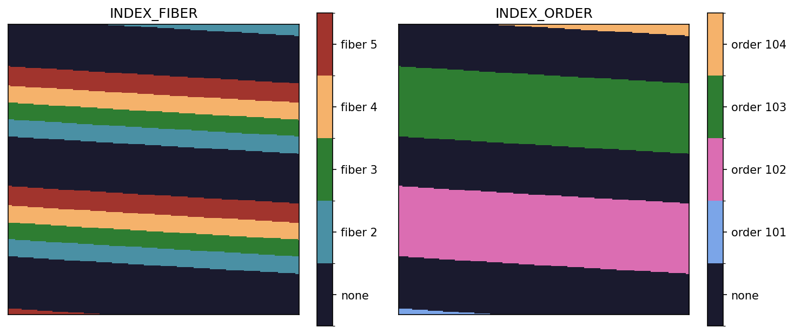

.. primitive_defineFlatStripes.rst

.. _primitive_defineFlatStripes:

*****************
defineFlatStripes
*****************

.. include:: generated_doc/maroonxdr.maroonx.primitives_maroonx_2D.MAROONX.defineFlatStripes_docstring.rst

.. include:: generated_doc/maroonxdr.maroonx.primitives_maroonx_2D.MAROONX.defineFlatStripes_param.rst

Algorithm
---------

.. todo::
    add description

   ``INDEX_FIBER`` and ``INDEX_ORDER`` pixel maps of a blue-arm master
   flat, over the same 300x300 detector region as the science-frame
   cutout in :ref:`maroonxdr_user_instrument`. Each pixel carries the
   fiber (left) and echelle order (right) it is assigned to; fiber 1 is
   dark in the current flat sets and therefore untraced.

Issues and Limitations
----------------------

.. todo::
    add description
