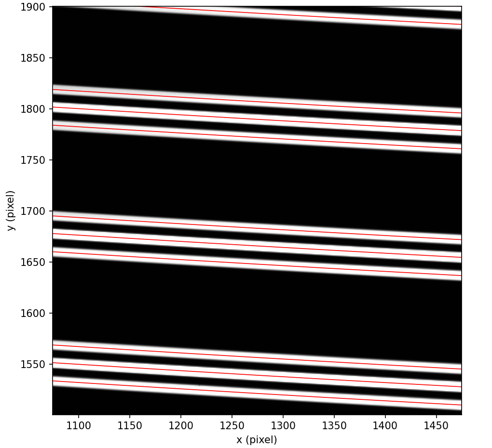

.. primitive_findStripes.rst

.. _primitive_findStripes:

***********
findStripes
***********

.. include:: generated_doc/maroonxdr.maroonx.primitives_maroonx_2D.MAROONX.findStripes_docstring.rst

.. include:: generated_doc/maroonxdr.maroonx.primitives_maroonx_2D.MAROONX.findStripes_param.rst

Algorithm
---------

.. todo::
    add description

   400x400 pixel cutout of a stacked ``DFFFD`` flat with the fitted
   stripe polynomials overplotted in red. At this stage the stripes
   are "anonymous"; fiber and order IDs are assigned
   later by ``identifyStripes``.

Issues and Limitations
----------------------

.. todo::
    add description