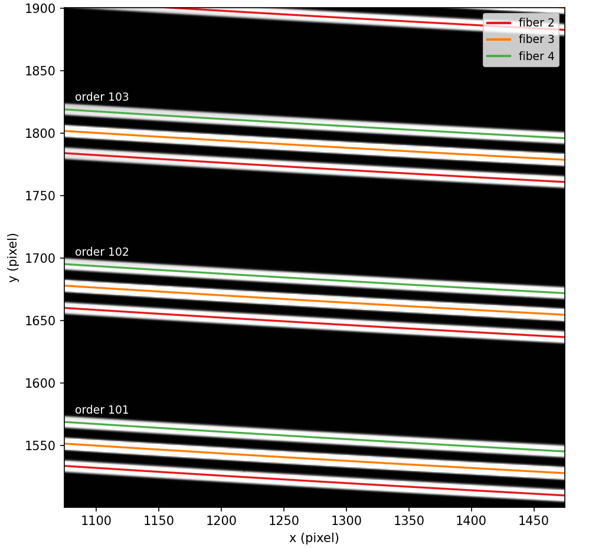

.. primitive_identifyStripes.rst

.. _primitive_identifyStripes:

***************
identifyStripes
***************

.. include:: generated_doc/maroonxdr.maroonx.primitives_maroonx_2D.MAROONX.identifyStripes_docstring.rst

.. include:: generated_doc/maroonxdr.maroonx.primitives_maroonx_2D.MAROONX.identifyStripes_param.rst

Algorithm
---------

.. todo::
    add description

   The stripes traced by ``findStripes`` in the same cutout, now
   assigned to fibers 2-4 and echelle orders 101-103 by matching the
   traces against nominal positions from the lookup table.

Issues and Limitations
----------------------

.. todo::
    add description
