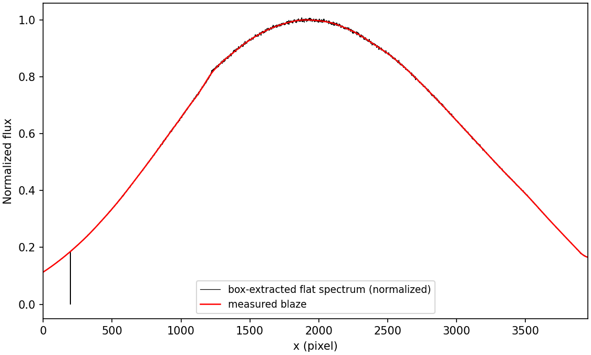

.. primitive_measureBlaze.rst

.. _primitive_measureBlaze:

************
measureBlaze
************

.. include:: generated_doc/maroonxdr.maroonx.primitives_maroonx_echelle.MAROONXEchelle.measureBlaze_docstring.rst

.. include:: generated_doc/maroonxdr.maroonx.primitives_maroonx_echelle.MAROONXEchelle.measureBlaze_param.rst

Algorithm
---------

.. todo::
    add description

   Box-extracted flat spectrum of fiber 3, order 107 (black),
   normalized to the scale of the blaze measured from it (red), which
   is stored in ``BLAZE_FIBER_3`` with unit maximum per order.

Issues and Limitations
----------------------

.. todo::
    add description
