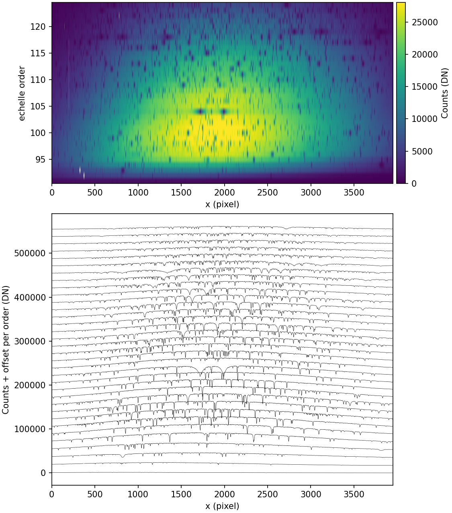

.. primitive_optimalExtraction.rst

.. _primitive_optimalExtraction:

*****************
optimalExtraction
*****************

.. include:: generated_doc/maroonxdr.maroonx.primitives_maroonx_echelle.MAROONXEchelle.optimalExtraction_docstring.rst

.. include:: generated_doc/maroonxdr.maroonx.primitives_maroonx_echelle.MAROONXEchelle.optimalExtraction_param.rst

Algorithm
---------

.. todo::
    add description

   Optimal extraction of fiber 3 of a ``SOOOE`` science frame (blue
   arm), as stored in ``OPTIMAL_REDUCED_FIBER_3``. Top: the extracted
   2D array, one row per echelle order. Bottom: the same spectra
   plotted per order with a vertical offset.

Issues and Limitations
----------------------

.. todo::
    add description
