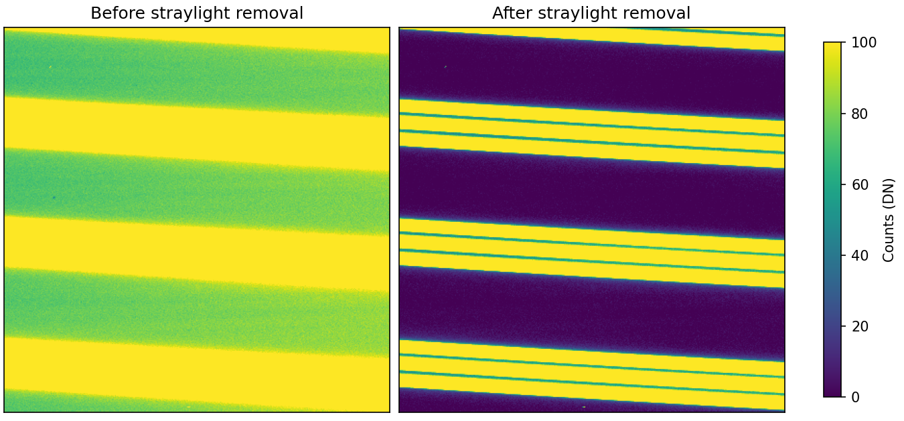

.. primitive_removeStrayLight.rst

.. _primitive_removeStrayLight:

****************
removeStrayLight
****************

.. include:: generated_doc/maroonxdr.maroonx.primitives_maroonx_2D.MAROONX.removeStrayLight_docstring.rst

.. include:: generated_doc/maroonxdr.maroonx.primitives_maroonx_2D.MAROONX.removeStrayLight_param.rst

Algorithm
---------

.. todo::
    add description

   The same 400x400 pixel cutout of a stacked ``DFFFD`` flat stream
   before (left) and after (right) straylight removal, at a common
   0-100 DN range that saturates the fiber stripes to expose the
   inter-order background.

Issues and Limitations
----------------------

.. todo::
    add description
